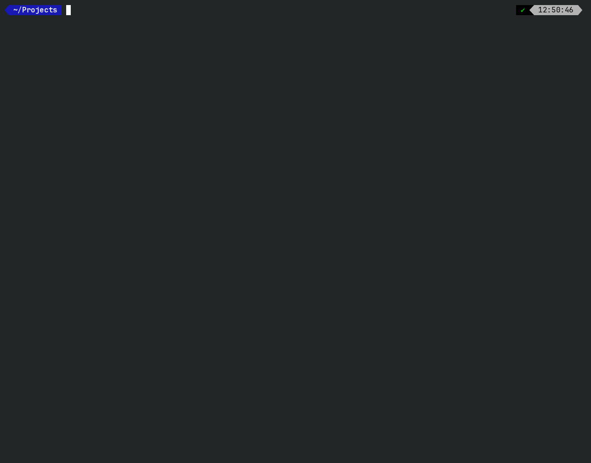

**DISCLAIMER: Use this project and any code it runs at your own risk.**

# Callisto

Callisto is a local coding agent. Two programs share the work:

1. **`callisto_server`** keeps chat sessions, generates text and exposes it over HTTP REST. It does not run tools.
2. **`callisto_cli`** is the agent. It talks to the server over HTTP and runs tools locally.

llama.cpp is vendored under `vendors/llama.cpp`. You do not clone or start `llama-server` yourself.

## The client

With no subcommand, `callisto_cli` opens a fullscreen session in the current directory. Thinking stays on one line until you open it. A tool call is one line, and opens while you answer the approval question. The assistant reply sits in a box. The context meter is in the upper right.



`exec` runs one task as plain text and then exits, for scripts. `health`, `session`, `send`, `job`, and `tools` talk to the HTTP API directly.

# Compile

You need CMake 4.1 or newer, a C++23 compiler, libcurl, and git. Ninja is optional. CUDA is optional and only needed for GPU inference.

Arch:

```bash
sudo pacman -S --needed base-devel git cmake ninja curl
```

Debian or Ubuntu: install the same packages with `apt` (`build-essential`, `cmake`, `ninja-build`, `libcurl4-openssl-dev`, `git`). Add the CUDA toolkit when you want GPU layers.

From the repository root:

```bash
cmake -B cmake-build-debug -DCMAKE_BUILD_TYPE=Debug
cmake --build cmake-build-debug -j$(nproc)
```

That produces:

- `cmake-build-debug/callisto_server`
- `cmake-build-debug/callisto_cli`
- `cmake-build-debug/callisto_tests`
- `cmake-build-debug/tests`

A Release build is the one to run a model with:

```bash
cmake -B cmake-build-release -DCMAKE_BUILD_TYPE=Release
cmake --build cmake-build-release --target callisto_server callisto_cli -j$(nproc)
```

GPU layers need CUDA turned on. `nvidia-smi --query-gpu=name,compute_cap --format=csv` prints the architecture number. An RTX 40-series card is `89`.

```bash
cmake -B cmake-build-release -DCMAKE_BUILD_TYPE=Release \
  -DGGML_CUDA=ON -DCMAKE_CUDA_ARCHITECTURES=89
cmake --build cmake-build-release --target callisto_server callisto_cli -j$(nproc)
```

The devcontainer image has no CUDA. `docker build . -t local_ai:latest` packages the binaries already built in `cmake-build-debug`. Build those first.

# Run

Download a GGUF model. This tree ships chat templates for Qwen3.8-27B and Ternary-Bonsai-2-27B under `src/templates/`. Pass `--chat-template` when the file inside the GGUF is not the one you want.

```bash
pip install huggingface_hub
python <<EOF
from huggingface_hub import snapshot_download
snapshot_download(repo_id="unsloth/Qwen3.8-27B-GGUF", allow_patterns=["*Qwen3.8-27B-UD-Q4_K_XL.gguf"], local_dir="Qwen3.8-27B-GGUF")
EOF
```

Start the server. `-c` is the context length. `-ngl 99` offloads layers to the GPU. The default bind address is `127.0.0.1:8080`.

```bash
./cmake-build-release/callisto_server \
  -m Qwen3.8-27B-GGUF/Qwen3.8-27B-UD-Q4_K_XL.gguf \
  -c 32768 -ngl 99
```

Start the client in the project you want it to edit:

```bash
./cmake-build-release/callisto_cli --host 127.0.0.1 -p 8080
```

Several models means several servers. Pass them at startup, or keep the list in `~/.config/callisto/servers.json`. The client connects to every server and uses the first one that answers. `/model` opens a dialog to switch. Switching starts a new session on that server and copies the conversation so far, so the next turn continues there.

```bash
export COLORTERM=truecolor ./cmake-build-release/callisto_cli \
  --server qwen=127.0.0.1:8080 \
  --server devstral=127.0.0.1:8081
```

Setting `COLORTERM=truecolor` is optional but gives you the best color experience

```json
{
  "servers": [
    {"model": "qwen", "host": "127.0.0.1", "port": 8080},
    {"model": "devstral", "host": "127.0.0.1", "port": 8081}
  ]
}
```

`--server` replaces the file. With neither, `--host` and `-p` are the single server. HTTP subcommands such as `health` and `session` still use `--host` and `-p`.

The fullscreen client still opens when every server is down. Status stays `offline`, and a chat message reports that none are reachable. The next message connects to the first server that answers.

One task from a script:

```bash
./cmake-build-release/callisto_cli exec "Summarize the README"
```

`--approval` is `read-only` by default. `auto` also allows writes inside the working directory. `full` asks for nothing. `--resume` continues the session saved in `~/.callisto/last-session` for this directory and server. `--hide-think` hides the thinking line. `--debug` leaves tool-call XML in the assistant text.

`web_search` calls a local SearXNG on port 4488. Start it with:

```bash
docker compose up -d
```

# Using the session

Reads run without a prompt. A write, a shell command, or a network tool asks first. The list is:

- **Yes, this once** (`y`)
- **No** (`n`)
- **Always this tool** (`a`)
- **Full access** (`f`)

Click a thinking line or a tool line to open it. `Ctrl-O` toggles the latest one. `Ctrl-C` cancels the current generation. `Ctrl-D` or `/exit` leaves.

| Command | What it does |
|---|---|
| `/help` | Show the commands |
| `/model [name]` | Open the server dialog, or switch by name |
| `/approval [mode]` | Show or set `read-only`, `auto`, or `full` |
| `/status` | Session id, approval mode, and server |
| `/diff` | `git diff --stat` for the working directory |
| `/map` | Rewrite `.callisto/map.md` from the tree |
| `/compact` | Summarize the chat into a new session |
| `/clear` | Start a new session |
| `/exit` | Leave |

`AGENTS.md` is added to the system prompt when it exists, otherwise `AI_INSTRUCTIONS.md` or `.github/copilot-instructions.md`. The text is capped at 2000 characters. On startup the client writes `.callisto/map.md`, a short index of the tree, and refreshes it when `git HEAD` changes. `/map` rewrites it. The model is told to read that file before searching an unfamiliar area. A skill is `.callisto/skills/<name>/SKILL.md`. The prompt lists each skill's name and one line. The model reads the file only when the task needs that procedure. Wide exploration belongs in `sub_agent`, which returns a summary and leaves the file contents out of the parent session.

Tools the client can run: `read_file`, `write_file`, `apply_patch`, `list_directory`, `file_search`, `search_text`, `execute_command`, `web_fetch`, `web_search`, and `sub_agent`. `apply_patch` replaces one unique stretch in an existing file. `write_file` creates a file or replaces all of it.

# Credits

Callisto sits on other people's work. Thank you.

| Project | Role | License |
|---|---|---|
| [llama.cpp](https://github.com/ggml-org/llama.cpp) and ggml | Model runtime in `callisto_server` | MIT, © 2023-2026 The ggml authors |
| [nlohmann/json](https://github.com/nlohmann/json) | JSON, both programs | MIT, © 2013-2025 Niels Lohmann |
| [cpp-httplib](https://github.com/yhirose/cpp-httplib) | HTTP, both programs | MIT, © Yuji Hirose |
| [FTXUI](https://github.com/ArthurSonzogni/FTXUI) | Fullscreen client | MIT, © 2019 Arthur Sonzogni |
| [CLI11](https://github.com/CLIUtils/CLI11) | Command-line parsing | BSD-3-Clause, © 2017-2025 University of Cincinnati, Henry Schreiner |
| [subprocess.h](https://github.com/sheredom/subprocess.h) | Process helper inside llama.cpp | The Unlicense |
| [libcurl](https://curl.se) | HTTP fetch in the client | curl license, system library |

The license texts those projects require for a binary build are in [`THIRD_PARTY_NOTICES.md`](THIRD_PARTY_NOTICES.md). Source copies keep their own `LICENSE` files. CLI11's BSD-3-Clause terms forbid using the University of Cincinnati or the contributors' names to endorse a product. The thanks above is attribution, not an endorsement.

SearXNG (AGPL-3.0) and Valkey (BSD-3-Clause) are optional separate services started by `docker-compose.yml`. They are not part of the Callisto binaries.
